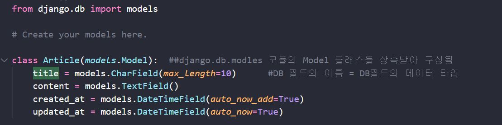

CRUD 순서

---

1. 어플리케이션에 models.py  작성.

   

---

2. 설계도 작성 makemigrations

   python manage.py makemigrations

3. 모델과 DB의 동기화

   python manage.py migrate

여기서 추가 필드를 작성했다면 

makemigrations 와 migrate를 해주어야한다.

---

장고쉘 켜서 db작성하기

python manage.py shell_plus

----------------

templates에

base.html 작성하고

#settings.py 에

TEMPLATES 부분에

[BASE_DIR / 'templates' ,],  작성하기

